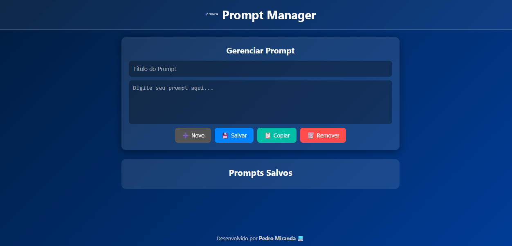

# 🧠 Gerenciador de Prompts

Uma aplicação web simples e moderna para **organizar, editar e salvar prompts** usados em inteligências artificiais como ChatGPT.  
Feita com **HTML, CSS e JavaScript puro**, projetada para ser leve, rápida e intuitiva.

---

## 🖼️ **Preview**

> Interface minimalista e responsiva com sidebar de navegação e editor dinâmico.

---

## 🚀 **Funcionalidades**

✅ Criar e editar prompts com título e conteúdo  
✅ Salvar automaticamente no navegador (LocalStorage)  
✅ Copiar conteúdo com um clique  
✅ Criar novos prompts rapidamente  
✅ Interface moderna com *glassmorphism*  
✅ Feedback visual (toast) ao salvar ou copiar  

---

## 🧩 **Estrutura do Projeto**

